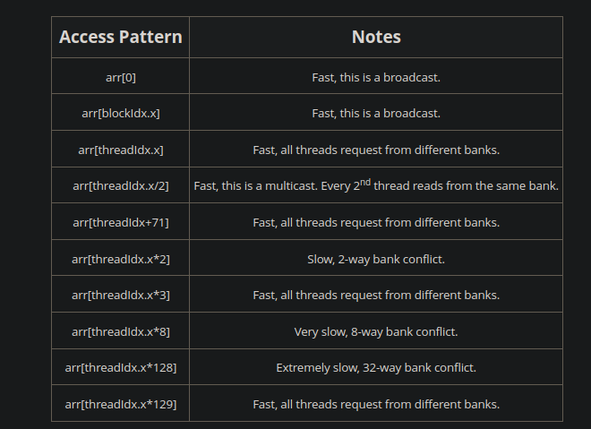

- maybe dont renumber vertices in input.cu
  - remeber to change to uint32_t then
  - sort on gpu
  - scan operation to recompute csr pointers
  - check by key stuff on thrust as that is kidna csr
  - learn hsitogram sparse vs dense
  - add ifddef for execution policy on device for debugging vs gpu
  - add sub threadgroup sync
  - template for printing vector

  - cliques of size 3 with normal algorithm for orientation

  ## tests
  - empty graph
  - dense histogram works for isolated vertices

  ## optim
  - don't calculate result for cliques size 1 and 2
  - consts for numer of edges etc.
  - texture memory for edges that are close 
  - for each with atomics instead of reduce by eky
  - host malloc to not page memory upon reading
  - maybe even jsut gather straight into pointer array
  - https://docs.nvidia.com/cuda/cuda-c-programming-guide/index.html#thread-block-clusters
  - --use_fast_math
  - --compiler-options "-fopenmp -fexceptions -ffast-math -g -Wall"

  - parity optim for non pivot version
  - parity optim for pruned bitmap for pivot version
  - extend it for as many levels as possible, at least tile size for non pruned bitmap, also only save to global once required
  - same can be done for rest of stack variables
  - current_lvl_idx +1 doesnt need to be set to 0 beforehand, we can just set current_idx = 0
  - adjust current lvl btimap to 2 is tile size is 1
  - add __restrict__

  - move bloocks and tiles to main level so we dont re init them every time we enter new vertex

## CRITICAL
  - don't calculate result for cliques size 1 and 2
  - for ec num_neighs is the number of 3 clqiues so dont count those either
  - investigate num neighs

## report
didnt use grid synchronisation as it seemed slower

const int tile_size = 4; // todo change to <= 8

const int threads_per_block = 128; // todo orginally 128
const int blocks_per_grid = 32;    // todo originally 32

direct done
res_dev:        1696415 11095298        28769868        148834439       183885507       759000981       142566591       576204696       731674867

real    16m27.866s
user    16m26.581s
sys     0m0.381s

const int tile_size = 4; // todo change to <= 8

const int threads_per_block = 256; // todo orginally 128
const int blocks_per_grid = 16;    // todo originally 32

direct done
res_dev:        1696415 11095298        28769868        148834439       183885507       759000981       142566591       576204696       731674867

real    19m3.618s
user    19m2.144s
sys     0m0.526s

const int tile_size = 8; // todo change to <= 8

const int threads_per_block = 128; // todo orginally 128
const int blocks_per_grid = 32;    // todo originally 32

direct done
res_dev:        1696415 11095298        28769868        148834439       183885507       759000981       142566591       576204696       731674867

real    16m34.401s
user    16m33.067s
sys     0m0.455s

const int tile_size = 2; // todo change to <= 8

const int threads_per_block = 128; // todo orginally 128
const int blocks_per_grid = 32;    // todo originally 32